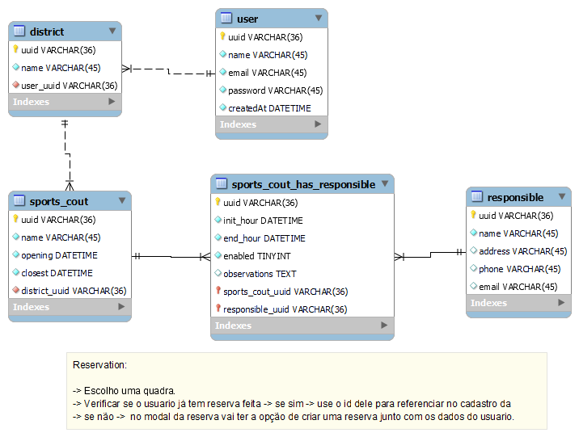
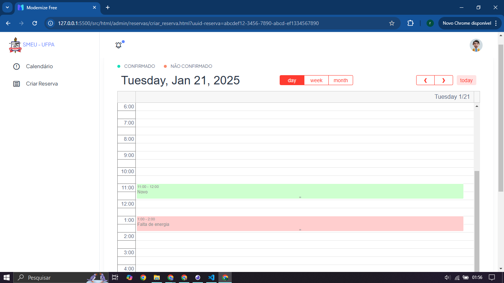
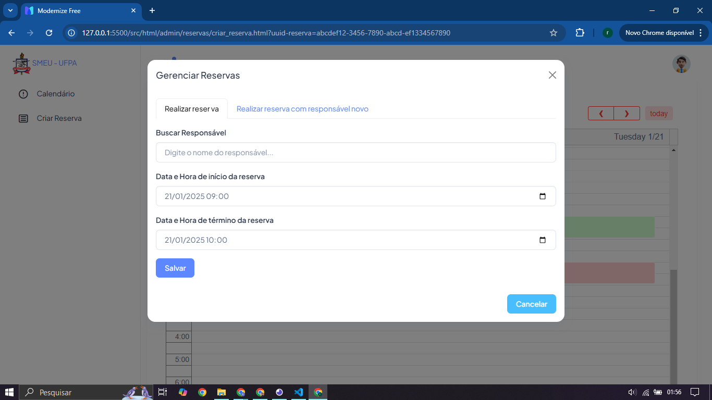

# ATIVIDADES CURRICULARES DE EXTENSÃO V
_Universidade Federal do Pará_

_Campus Universitário do Tocantins/Cametá_

_Faculdade de Sistemas de Informação_

_Professor Me. Leonardo Nunes Gonçalves_

# 1 - PROPOSTA DE TRABALHO
O projeto tem como objetivo desenvolver um painel administrativo voltado para a gestão de horários de uma quadra ou campo esportivo. Através dessa ferramenta, os administradores poderão organizar e gerenciar a alocação de horários, facilitando o controle de reservas e otimizando a utilização do espaço.

O painel permitirá ao administrador visualizar os horários disponíveis, realizar agendamentos de forma prática e eficiente, e gerenciar as informações de cada reserva. Além disso, a ferramenta deve oferecer a funcionalidade de envio de notificações diretamente para os jogadores relacionados a um horário específico, garantindo a comunicação rápida e eficaz sobre alterações, confirmações ou cancelamentos.

Essa solução busca não apenas simplificar o gerenciamento interno, mas também aprimorar a experiência dos usuários, promovendo maior transparência e organização no uso das instalações esportivas.


# 2 - REQUISITOS DO SISTEMA
**_Administrativos_**

1. Deve ser possível agendar um horário
2. Deve ser possível listar todos os horários de forma (diária e semanal)
3. Deve ser possível cancelar um horário. Atenção ao cancelar um horário é necessário o que o administrador explique a motivação do cancelamento.
4. É necessário que para cada operação de agendamento ou cancelamento do horário seja emitido uma notificação para os usuários responsáveis pelo horário.

**_Geral_**

1. Deve ser possível visualizar todos os agendamentos (diário e semanal).

##### VANTAGENS DE USAR A ARQUITETURA SOLID + MVC
- Este sistema está escalavel para muitas funcionalidades.


#### REQUISITOS NÃO FUNCIONAIS
- O sistema deve ser acessível através de qualquer dispositivo conectado á internet.
- A interface do usuário deve ser intuitiva e fácil de usar.
- As informações de reserva devem ser armazenadas de forma segura.


# 3 - MODELO ENTIDADE RELACIONAMENTO



# 4 - PRINCIPAIS INTERFACES DO SISTEMA

**_Visão geral da aréa de reservas de um espaço_**



**_Criando uma reserva com um usúario existente_**



**_Criando uma reserva com um usúario novo_**


# 🚀 Começando

Essas instruções permitirão que você obtenha uma cópia do projeto em operação na sua máquina local para fins de desenvolvimento e teste.


# 📋 Pré-requisitos


Para execultar o software, você precisa ter os seguintes programas instalados em sem computador.
- node js
- vscode

# 🔧 Instalação

Siga o passo-a-passo que informam o que você deve executar para ter um ambiente de desenvolvimento em execução.

Faça o clone desse projeto usando os seguintes comandos do github:

```
git clone https://github.com/renne10dias/SMHQ.git
```

Após clonar o projeto em sua pasta na sua maquina, execulte o seguinte comando:

```
npm run dev
```

O terminal deve mostrar algo parecido com isso.

```
> smeu-ufpa-solid-mvc@1.0.0 dev
> tsx watch src/main.ts        

Server running on port 8000
```
PRONTO, o projeto já está em execução.

# ⚙️ Executando os testes

Explicar como executar os testes automatizados para este sistema.

### 🔩 Rotas para acesso a API REST do projeto.

Rotas responsaveis para realizar as funcionalidades do projeto.

GET - Listagem e busca de reservas

```
localhost:8000/reservation/getAllReservations
localhost:8000/reservation/getReservationsWithResponsibleAndSportsCout/91f3e8ac-20c1-45b3-b80b-b6f798f92e9e
```

#### POST - Inserção de customers
- Podemos criar reservas com novos responsáveis ou com responsáveis cadastrados no sisteme.

```
localhost:8000/reservation
localhost:8000/reservation/createReservationAddResponsible
```

# ⚙️ Acessando a Interface do sistema

**_Execulte o arquivo "listar_espacos_para_reserva.html_**


# 🛠️ CONTRUÍDO COM

Ferramentas usadas para a criação desse projeto.

* ***[Node.js®](https://nodejs.org/en)*** - é um ambiente de execução JavaScript gratuito, de código aberto e multiplataforma.
* ***[Typescript®](https://www.typescriptlang.org/)*** - TypeScript é uma linguagem de programação fortemente tipada baseada em JavaScript, oferecendo melhores ferramentas em qualquer escala.
* ***[Express](https://expressjs.com/)*** - Express.js é um framework para Node.js que fornece recursos mínimos para construção de servidores web.
* ***[Prisma](https://www.prisma.io/)*** - O Prisma oferece a melhor experiência para sua equipe trabalhar e interagir com bancos de dados.Até mesmo coisas complexas como pool de conexões, cache e assinaturas de banco de dados em tempo real são muito fáceis com nossos produtos.

# 🛠️ PORQUE ESSA FERRAMENTAS DE DESENVOLVIMENTO


**_Node.js_**
- Desempenho e Escalabilidade: Graças ao seu modelo de operação baseado em eventos e não bloqueante, o Node.js é altamente eficiente para aplicações em tempo real e sistemas que requerem alto desempenho.

- Ecosistema Rico: Com a NPM, você tem acesso a uma vasta gama de pacotes e bibliotecas que aceleram o desenvolvimento.

- Multiplataforma: Funciona em qualquer sistema operacional, facilitando o desenvolvimento e a implantação.

**_TypeScript_**
- Segurança e Robustez: TypeScript adiciona tipagem estática ao JavaScript, ajudando a evitar erros comuns e garantindo maior confiança no código.

- Escalabilidade: Facilita a manutenção de projetos grandes, permitindo detectar erros em tempo de compilação e simplificando o refatoramento.

- Ferramentas Poderosas: Oferece uma excelente experiência de desenvolvimento com recursos como autocomplete, refatoração inteligente e checagem de tipos.


**_Express.js_**
- Flexibilidade e Simplicidade: É minimalista, permitindo que você configure e expanda funcionalidades conforme necessário, sem sobrecarregar o projeto com abstrações desnecessárias.

- Ampla Adoção: Possui uma comunidade enorme e rica documentação, facilitando encontrar soluções para problemas ou integrar bibliotecas.

- Compatibilidade com Middlewares: Permite manipular requisições de forma modular, facilitando a adição de autenticação, validação e outras funcionalidades.

**_Prisma_**
- Interface Intuitiva com o Banco de Dados: Abstrai a complexidade de escrever consultas SQL, proporcionando uma API amigável para interagir com o banco de dados.

- Sincronização Automática do Esquema: Facilita a migração e sincronização entre o modelo de dados e o banco, economizando tempo.

- Desempenho Otimizado: Gerencia conexões, realiza caching e até assina mudanças no banco de dados em tempo real, otimizando a performance da aplicação.

- Documentação e Segurança: Garante maior clareza sobre como os dados são manipulados, reduzindo erros e problemas relacionados à segurança.

- Integração Fluida: TypeScript melhora o desenvolvimento tanto no Express quanto no Prisma, oferecendo tipagem robusta que reduz erros.

- Desempenho com Escalabilidade: Node.js e Express garantem alta performance em serviços modernos, enquanto o Prisma facilita a interação eficiente com o banco.

- Produtividade e Manutenibilidade: Essa stack simplifica a criação de aplicações robustas e prontas para escalar, economizando tempo de desenvolvimento e facilitando o crescimento do projeto.

# 🛠️ PADRÃO DE PROJETO APLICADO - DESIGN PATTERNS
Padrões de projeto (design patterns) são soluções típicas para problemas comuns em projeto de software. Cada padrão é como uma planta de construção que você pode customizar para resolver um problema de projeto particular em seu código.

Padrões são como um conjunto de ferramentas
para soluções de problemas comuns em design
de software. Eles definem uma linguagem
comum que ajuda sua equipe a se
comunicar mais eficientemente.

## SOLID
O acrônimo ***SOLID*** é um conjunto de princípios de design de código que visam facilitar a manutenção e a evolução do software. Ele foi introduzido por Robert C. Martin em 2000 e é composto por cinco princípios:

- **S** - Single Responsibility Principle (Princípio da Responsabilidade Única)


- **O** - Open/Closed Principle (Princípio do Aberto/Fechado)
- **L** - Liskov Substitution Principle (Princípio da Substituição de Liskov)
- **I** - Interface Segregation Principle (Princípio da Segregação de Interfaces)
- **D** - Dependency Inversion Principle (Princípio da Inversão de Dependências)

  

## MVC

O ***MVC*** é um padrão de arquitetura de software que separa a aplicação em três componentes principais: Model, View e Controller. O objetivo é separar a lógica de negócio da interface do usuário, facilitando a manutenção e a evolução do software.

- **Model** - Representa a camada de dados da aplicação. É responsável por acessar o banco de dados, realizar operações de CRUD e representar os objetos de negócio.

- **View** - Representa a camada de apresentação da aplicação. É responsável por exibir os dados ao usuário e capturar as interações do usuário.

- **Controller** - Representa a camada de controle da aplicação. É responsável por receber as requisições do usuário, chamar os métodos de serviço e retornar a resposta ao usuário.

  

# ✒️ Integrantes


* **Renne Dias** - *Trabalho Inicial* - [umdesenvolvedor](https://github.com/linkParaPerfil)
* **Josienson Dasmaceno** - *Trabalho Inicial* - [umdesenvolvedor](https://github.com/linkParaPerfil)
* **Naylan Sanches** - *Trabalho Inicial* - [umdesenvolvedor](https://github.com/linkParaPerfil)
* **Paulo Rafael** - *Trabalho Inicial* - [umdesenvolvedor](https://github.com/linkParaPerfil)
* **Vinicios Prestes** - *Trabalho Inicial* - [umdesenvolvedor](https://github.com/linkParaPerfil)
* **Eric Alves** - *Trabalho Inicial* - [umdesenvolvedor](https://github.com/linkParaPerfil)


# 📄 Licença

Este projeto está sob a licença (projetosdiasdev) - visite o [SITE](https://projetosdiasdev.com).

# 🎁 Expressões de gratidão

* Conte a outras pessoas sobre este projeto 📢;
* Convide alguém da equipe para uma cerveja 🍺;
* Um agradecimento publicamente 🫂;
* etc.


---
⌨️ com ❤️ por [Renne Dias](https://github.com/renne10dias) 😊 e equipe
